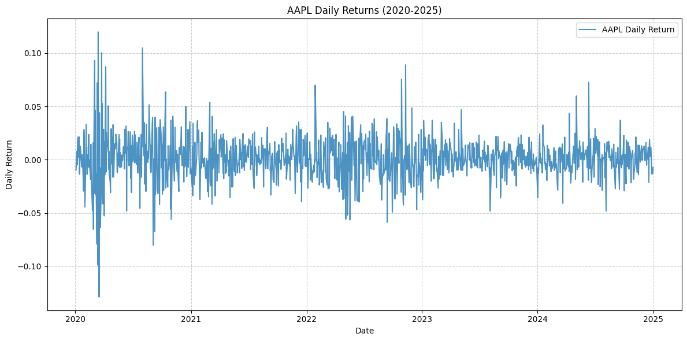
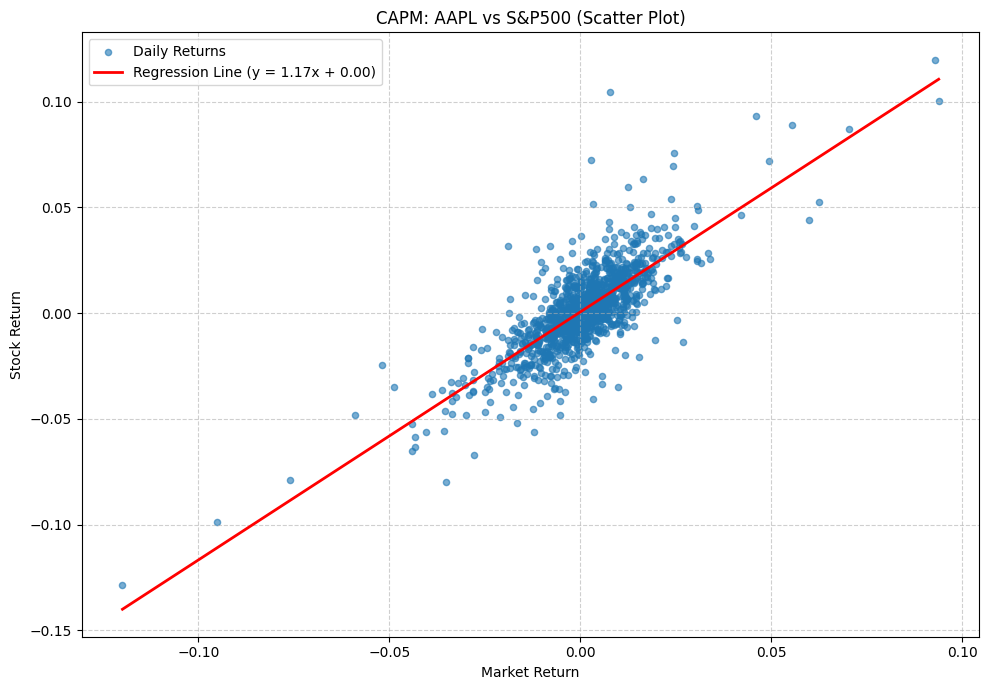

# Stock Return Analysis using Python

## Objective
Analyze the relationship between stock returns and market returns using CAPM.

## Tools
- Python
- Pandas
- NumPy
- Matplotlib
- Scikit-learn

## Methodology
1. Data preparation
2. Exploratory Data Analysis
3. Return statistics
4. CAPM regression
5. Model evaluation

## Results
Estimated alpha and beta coefficients
## CAPM Model Results

Using real market data from Yahoo Finance, this project estimates the relationship between Apple (AAPL) daily returns and S&P500 market returns.

### Model

The CAPM regression model is:

R_stock = α + β R_market + ε

Where:
- α represents the excess return (Alpha)
- β represents the sensitivity of the stock to market movements (Beta)
- ε represents the unexplained component

### Results

The estimated model produced the following results:

- Beta (β): 1.17
- Alpha (α): 0.000524
- R² Score: 0.625

### Interpretation

- The estimated beta of 1.17 indicates that Apple has historically been slightly more volatile than the market. A 1% change in the market return is associated with approximately a 1.17% change in Apple's return.
- The positive alpha suggests a small daily excess return beyond what is explained by market movements.
- The R² score of approximately 0.62 indicates that around 62% of the variation in Apple's daily returns is explained by market returns in this single-factor CAPM model.

## Visualization

The project includes:
- Daily return visualization
- CAPM scatter plot
- Regression line showing the relationship between market and stock returns
- ## Visualizations

### Daily Returns

### CAPM Regression

## Data Source

Historical price data was obtained using the Yahoo Finance API through the `yfinance` Python library.

## Future Improvements

Future extensions of this project include:

- Adding multiple stocks for comparison
- Calculating Sharpe Ratio and volatility metrics
- Implementing Fama-French factor models
- Using longer historical periods
- Building interactive dashboards
- 
